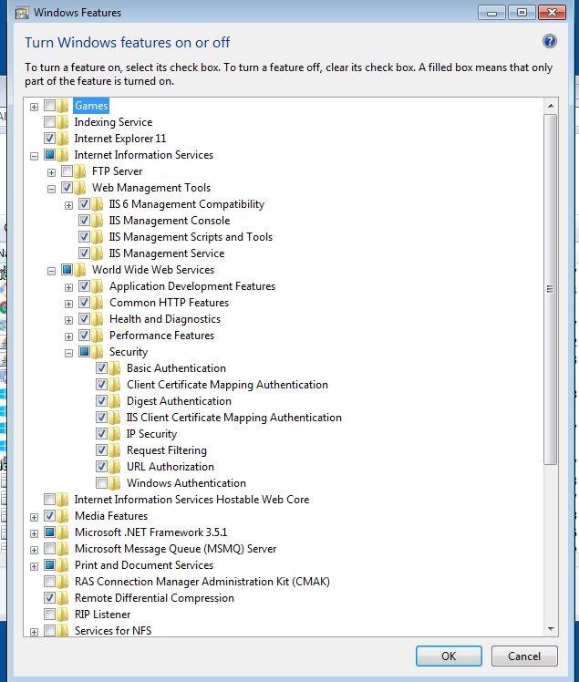

# Uintra - A social framework
A flexible and lightweight Umbraco based framework, for making an Intranet, Extranet or social platform based on known conventions.

## Why Open Source?
We are trying to create a flexible and robust social framework. We think the best way to achieve this is through an online community, that can share and iterate through ideas. In order to create a solution that has valuable functionality validated by the users.
Getting started
These instructions will get you a copy of the project up and running on your local machine for development and testing purposes. See deployment for notes on how to deploy the project on a live system.

## Prerequisites & Installing
Before installing Uintra you will have to make certain preparations

1. Install MS NET Framework .NET 4.7.1, can be found [here](https://www.microsoft.com/en-us/download/details.aspx?id=56115)

2. Install IIS with advanced settings (as seen in the screenshot below)

3. Install Visual Studio 2017 with update 15.3 or [later](https://visualstudio.microsoft.com/)

3. Download and install [Ubraco CMS 7.9.2 nuget package](https://our.umbraco.com/download/releases/792/) by the Visual studio 'Manage NuGet Packages for Solution' NOT by the 'Package manage console'

4. Continue Umbraco installation in a browser 
* Customize settings and use custom SQL server.
* Create an empty SQL DB
* Configure Umbraco custom settings (server, DB, authentication)

5. Download the latest version of Uintra here: https://www.nuget.org/packages/uIntra/
* Install the latest Uintra nuget package in the Visual studio 2015/17 'Manage NuGet Packages for Solution' NOT by the 'Package manage console'

If you are having trouble getting Uintra installed or experience other problems, please contact us at kne@Compent.net, the response time will be very fast within normal business hours, 09-16 CET/CEST.

## Running tests
We have created some simple examples of how to manually test Uintra [here](Testing.md).

## Contributing to Uintra?
A good way to contribute to Uintra is by providing issue reports. For information on how to submit an issue report refer to our [guide to contributing](CONTRIBUTING.md) for details on our code of conduct, and information regarding the process for submitting pull requests to us.

## Contact
We have several managers and a full team working on Uintra, if you have any questions please send them to our contact person, Kasper at kne@compent.net. 

## License
This project is licensed under the [MIT License](LICENSE.md) - see the file for details.
